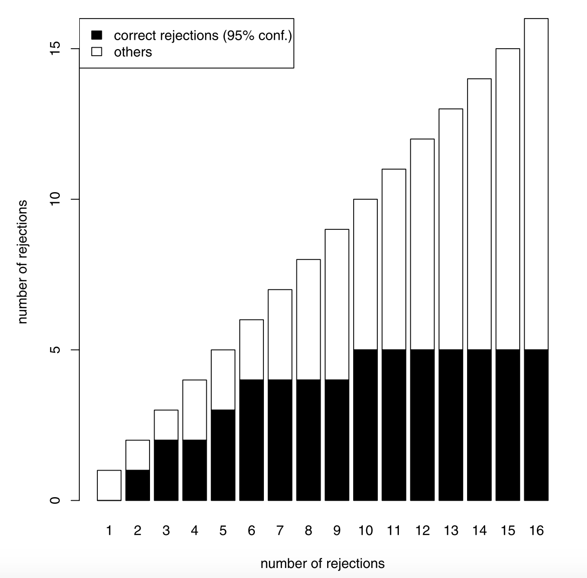

<!-- $theme: gaia -->
<!-- _class: gaia -->

# Multiple Testing for Exploratory Research 

###### Jelle J. Goeman and Aldo Solari 2011

---

## Agenda

- Motivation
- Introduction to closed testing
- The proposed procedure
- Example
- Shortcuts
- Point estimation

---
<!-- _class: lead -->
<!-- _class: gaia -->

# 1. Motivation

### 

---

# Exploratory vs Confimatory Data Analysis

In EDA we want to generate hypothesis by looking at our data set.

In CDA we want to confirm those hypothesis using rigorous testing procedures. 

Generally EDA is less structed and the researcher has more freedom than it CDA.

--- 

# Exploratory vs Confimatory Data Analysis

On recent years, multiple testing is being use also for EDA. 

In genomics research, an experiment will:
- test a big numbers of hypothesis 
- select some of them using multiple testing  (EDA)
- validate by another experiment, also MT (CDA)

--- 

# Exploratory vs Confimatory Data Analysis

The reason they use multiple testing on EDA, is that the researchers want to minimize false discovery, not to fail to much validation test.

However, MT methods are built for CDA. 

The paper presents an approach that would let researchers **estimate false rejection** while keeping **freedom** on which hypothesis to reject.

--- 

# Example

We want to predict **genes activity** on 30 sick people 

---

# Example

We want to predict **genes activity** on 30 sick people

*Not really*

---

# Example

We want to predict **grade for the seminar**, using data and grades of last year's presentation

Our EDA phase will select features we could use, based on features available for last years

We want to prioritize features that will be easy to collect

---

# Example

Based on the data we already have for last year, our candidates features can be: 

- duration of the presentation
- \# of slides
- 1 or 2 presenters 
- avg of the presenters on their degree
- \# of memes in the presentation
- *... a lot of others reported for last year*

---

# Example

*This is a dummy example just to make my point, please don't argue me*

Let's say we decide to use **linear regression** on our dataset and check the p-values:
	
    nb of memes 0.00012
    duration of pres 0.003
    nb of presenters 0.021
    avg of presenters in degree 0.034
    number of slide 0.12
    ...
    
:sweat:

---

# Starting point

In the exploratory data analysis phase, I don't want to **decide**. 

In regular research the user decide of an error component and ==the procedure rejects the hypothesis it wants==. 
*Reject # of memes but not avg of presenters for FWER < 0.05*
    
---

# Starting point

In the exploratory data analysis phase (EDA), I don't want to **decide**. 

In EDA the user ==choose which hypothesis to reject== and the procedure gives him a confidence statement of how many False Rejection.
*What do I risk if I choose only the 3 first variables after nb of memes?*

**Why would I do that?**
Do you really want to count the number of memes in each presentations? 

---

# The three requirements
The authors define 3 requirements for  an inferential procedure for exploratory research. It has to be *mild, flexible and post-hoc.*

Now we will define those requirements and study whether FWER and FDR procedures are meeting them.

---

# Reminder Holm-Bonferroni method

- Choose $\alpha$ as a significance level
- Let $H_1, ..., H_m$ be a family of $m$ null hypotheses and $P_1, ..., P_m$ the corresponding p-values, ordered from lowest to highest
- Let $k$ be the minimal index such that $P_k \gt \frac{\alpha}{m+1-k}$
- Reject $H_1,..., H_{k-1}$ for $FWER \leq \alpha$

<!---
CAN INCLUDE A PROOF HERE
-->

---

# Reminder Binyamini-Hochberg method

- Choose $q^*$ the desired FDR
- Let $H_1, ..., H_m$ be a family of $m$ null hypotheses and $P_1, ..., P_m$ the corresponding p-values, ordered from lowest to highest
- Let $k$ be the largest index such that $P_k \leq \frac{k}{m}q^*$
- Reject $H_1,..., H_{k}$ for $E(FDR) \leq q^*$

---

# The three requirements

#### \# 1 MILD

The procedure needs to allow some False Positives. 
If it does not there would not be a need for validation..

**Is FWER mild ?** Nop

**Is FDR mild ?** Yes

By definition of both of them.

---

# The three requirements

#### \# 2 Flexible

The procedure needs to allow to user to choose the hypotheses to select.
As described above I might want to choose the 3 variables after *# of memes* but not this one.

**Is FWER flexible ?** Partly: we can refrain to reject an hypothesis but not the inverse.

**Is FDR mild ?** No, even selecting a subset of the hypotheses can break the condition. *Let's see an example*

---

# The three requirements

#### \# Why FWER is partly flexible
Let $S = \cap_{1,..,n}{H_i}$ and $R = \cap_{1,..,m}{H_i} \subset S$
$$P(R) \leq P(S)$$

So if we can reject $S$ at a $\alpha$ significance level, we can reject $R$ at $\alpha$ as well.

---

# The three requirements

#### \# Why FDR is not flexible
- Take 16 hypotheses, and $q^*=0.1$. Suppose ${p_1, ..., p_8} \approx 0$ and ${p_9, ..., p_{16}} = 0.05$ 
- The p-value of the 8 last $\lt \frac{9}{16}0.1 = 0.056$ so we can reject all of hypothesis.
- Assume we want to reject only the last 8, we have $p_8 \gt \frac{1}{8}0.1 = 0.0125$ and we cannot reject any.

---

# The three requirements

#### \# 3 Post Hoc

Finally the procedure has to be post hoc, meaning that all choices inherent to the procedure can be made after seeing the data.

**Is FWER post hoc ?** No, the significance level has to be determined before looking at the data.

**Is FDR mild ?** Neither, the fdr and the hypothesis have also to be determined before starting the procedure.

---

# The three requirements

#### \# Recap 

We are looking for a procedure is:

- *mild*: allows FP
- *flexible*: allows us to choose which hypothesis to select
- *post hoc*: allows us to explore the data before making any decision on the procedure itself

---

# The three requirements

#### \# Recap 

This will be done by inversing the regular role.

**Regular**: user choose the quality criterion and letting the procedure decide which hypothesis to reject.

**Here**: user choose the hypothesis to reject and the procedure is returning the quality criterion (ex: FDR).

---

<!-- _class: gaia -->

# 2. The closed testing procedure

### 

---

# Closed testing procedure

The CTP has been introduced by Marcus (TAU), Peritz and Gabriel in 1976.

The idea is to reject an hypothese $H_k$ called elementary hypothese at confidence $\alpha$, if we can reject all set of hypothesis $S$ with $H_k \in S$ at confidence $\alpha$.

Those sets of hypothesis can be defined using different methods. Makes closed testing a family of procedures.

---

# Closed testing procedure

The name closed testing comes from the fact that all the hypothesis have to be closed under intersection.

*:bulb: Reminder:*
*A set of null hypothesis $S$ is said to be closed under intersection if, for any $H_i, H_j \in S$  we have $H_i \cap H_j \in S$*.

Broadly speaking, it means that those hypothesis are compatible.

---

# Example

- Consider three hypotheses $H_1, H_2, H_3$ and a significance level $\alpha$.
- Reject $H_1$ iff $H_1$, $H_1 \cap H_2$, $H_1 \cap H_3$, and $H_1 \cap H_2 \cap H_3$ can be rejected at a significance level $\alpha$

---

# Example

$$\underline{H_{123}} $$
$$\underline{H_{12}} \quad \underline{H_{13}} \quad {H_{23}}$$
$$\underline{H_{1}} \quad \underline{H_{2}} \quad H_{3}$$

Here we reject $H_1$ only.

---

# Properties
*:star:	Claim:*
*The closed testing procedure controls the FWER*.

*Proof:*
Let's define:
	- $A$ the event of having at least one type I error
	- $B$ to event of rejecting all **true** null hypotheses
Clearly following the CT procedure: $A \cap B = A$
and:
$P(A) = P(A\cap B) = P(B)P(A|B) \leq \alpha$, because B has been rejected at confidence $\alpha$.
	
---

# Properties
*:star:	Claim:*
*Using a Bonferroni test for intersecting hypothesis we obtain the Holms procedure*.

*Proof:*
The Bonferroni test for a set of hypothesis is defined as following:

reject $H_S$ **iff** $\inf\{p_i: i\in S\} \leq \frac{\alpha}{|S|}$

---

# Properties
reject $H_S$ **iff** $\inf\{p_i: i\in S\} \leq \frac{\alpha}{|S|}$

Given that, we don't need to compute all intersections test.
Indeed:

Let $S_{j+}$ be the set of all the $n-j+1$ hypotheses with the largest p values. Then if we reject $S_{1+},.., S_{j+}$ so we reject $H_j$

<!---
Explain on the board that if we reject Sj+, we reject any set for which the minimum  is pj.
Doing by considering S such set and a/|S| > a/|Sj+|
-->
Which is equivalent to:
$p_1 \leq \frac{\alpha}{n}$, ..., $p_j \leq \frac{\alpha}{n-j+1}$

---

# Consonant procedure
Let's take another example

$$\underline{H_{123}} $$
$$\underline{H_{12}} \quad \underline{H_{13}} \quad \underline{{H_{23}}}$$
$$\underline{H_{1}} \quad H_{2} \quad H_{3}$$

The rejection $H_{23}$ does not help to reject any elementary hypothesis, we call it **non-consonant** rejection.

A **consonant** procedure does not have any non-consonant rejection.

---

# Consonant rejections

Usually consonants procedures are prefered because they may imply gain of power.

However a **mild** procedure can take interest of the non-consonant rejections.

Let's say we choose to reject $H_2$ and $H_3$, what information the consonant rejection can give me about the risk taken?

It is important to notice that $H_{23}$, just like $H_1$ could be rejected with confidence $1-\alpha$. 

---

<!-- _class: gaia -->

# 3. The procedure

### 

---

# Main idea

The idea of the procedure is to build a **$1-\alpha$ confidence set** on the number of false rejections, as a function of the rejected set.

We want something like: 
$$\tau({H_1, H_3}) \in (0, 1)$$ 

---

# Main idea

In order to do so, the authors decided to look at the closed testing results. 
Let $t$ be the biggest subset in our rejection set that **is not rejected** by the closed testing procedure.

Then $\{1, ..., t\}$ is a $1-\alpha$ confidence interval for the number of false rejection.

$\alpha$ is defined while building the CT procedure.

---

# Example
*Let's start with an example and we will prove it more fomally*

$$\underline{H_{123}} $$
$$\underline{H_{12}} \quad \underline{H_{13}} \quad \underline{{H_{23}}}$$
$$\underline{H_{1}} \quad H_{2} \quad H_{3}$$

What confidence set I get if I reject: $H_1$ | $H_2$ | $H_{23}$ | $H_{123}$

<!-- {0} | {0, 1} | {0, 1} | {0, 1} -->

<!--
# Example
*Let's start with an example and we will prove it more fomally*

$$\underline{H_{1234}} $$
$$\underline{H_{123}} \quad \underline{H_{124}} \quad \underline{H_{134}} \quad {H_{234}}$$
$$\underline{H_{12}} \quad \underline{H_{13}} \quad \underline{H_{14}} \quad H_{23} \quad \underline{H_{24}} \quad H_{34} $$
$$\underline{H_{1}} \quad  \underline{H_{2}} \quad H_{3} \quad H_{4}$$

What confidence set I get if I reject: $H_1$ | $H_3$ | $H_2, H_3$ | $H_1, H_2, H_3$
-->

---

# Proof

Let $R$ be a set of rejected elementary hypothesis
$X$ be the set of hypothesis (elementary and interserction) rejected by the CT procedure
$C$ the set of all the hypothesis (elementary and interserction)
$C_R$ the set of the rejected hypothesis in $C$ by $R$
$\tau(R)$ is the number of false rejection
Finally $t_\alpha(R)= \max \{ \#I: I \in C_R, I \notin X \}$

*:bulb: Claim:*
*$\{0, ..., t_\alpha(R)\}$ is a $1-\alpha$ confidence set for $\tau(R)$*

---

# Proof

- Let's assume that all the closed testing rejections are correct
- Suppose now $\tau(R) \gt t_\alpha(R)$
$\Rightarrow$ $\exist I$ such that $\#I \gt t_\alpha(R), I \in C_R$ and $I$ is true
$\Rightarrow$ $I \in X$ and $I$ is true
$\Rightarrow$ The closed testing rejected a true hypothesis
- So if the closed testing rejections are correct then $\tau(R) \in \{0, ..., t_\alpha(R)\}$
- This happens with probability $1-\alpha$

---

# Proof

$$\underline{H_{123}} $$
$$\underline{H_{12}} \quad \underline{H_{13}} \quad \underline{{H_{23}}}$$
$$\underline{H_{1}} \quad H_{2} \quad H_{3}$$

Assuming 2 errors for $H_{13}$ | $H_{23}$

*Remember that $H_{23}$ can be rejected with confidence $1-\alpha$*

--- 

# The set $\phi(R)$

We might also want to quantify the true hypothesis in $R$

The number $\phi(R)$ is simply $\#R - \tau(R)$ and a confidence set can be derived:
$$\{f_\alpha(R), ..., \#R\}$$
where $f_\alpha(R) = \#R - t_\alpha(R)$

--- 

# The set $\phi(R)$

*Let's start with an example and we will prove it more fomally*

$$\underline{H_{123}} $$
$$\underline{H_{12}} \quad \underline{H_{13}} \quad \underline{{H_{23}}}$$
$$\underline{H_{1}} \quad H_{2} \quad H_{3}$$

What confidence set for $\phi(R)$ I get if I reject: $H_1$ | $H_2$ | $H_{23}$ | $H_{123}$

<!-- {1} | {0, 1} | {1, 2} | {1, 2, 3} -->

---

# Recap

- We used a non consonant closed testing procedure on our data
- From it we derive a confidence set for the number of errors for any proposed rejection set
- Those confidence set are available simultaneously without any prior choice on the experiment

---

# Back to our 3 requirements
The procedure fulfills the 3 requirements described before:
 - **Flexible:** The user does not have to select hypotheses to go on with

- **Mild:** Allows FP

- **Post Hoc:** The user can view all possible consequences of his selection before making a final choice

--- 

<!-- _class: gaia -->

# 4. Example

### 
---

# Setup

The authors propose to use their procedure to help selecting variables for linear regression.

They consider the *physical* dataset, that contains 10 measurements (length, and circumference of various parts of the body) to predict the body mass.

Some previous analysis suggests selecting the four variables: forearm, waist, height and thigh.

---

# Setup

The table belows shows the p-values (t-test) on the relevance of each variables in both models.

| Covariate   |      Full model      |  Selected model |
|----------|:-------------:|------:|
| (Intercept)| 0.036 | 0.000 |
| Forearm | 0.061 | 0.000 |
| Biceps | 0.755 | - |
| Chest |  0.420 | - |
| Nest |  0.518   | - |
| Shoulder | 0.905 | - |
| Waist |  0.000 | 0.000 |
| Height | 0.033 | 0.005 |
| Calf | 0.303 | - |
| Thigh | 0.351 | 0.036 |
| Head | 0.105 | - |

---

# Setup

The p-values are computing by testing the hypothesis $\beta_k=0$ where $\beta_k$ is the least-square estimate of the coefficient for the $k^{th}$ variable.

The statistic:

$$t_k = \frac{\hat\beta_k}{\sigma(\hat\beta_k)}$$

<!-- sigma is MSE * std in x_k -->

Is $t$ distributed under $H_0$.

---

# Experiment

The experiment takes place as following:

- The authors fit a linear regression with the 10 variables and an intercept
- They define $\{H_1, ..., H_{10}\}$ elementary hypothesis that the corresponding $\beta_k = 0$
- They construct 1023 intersection hypothesis

:star: $1023 = 2^{10} - 1$

---

# Experiment

Testing $\beta_{12} = 0$ cannot be done with the previous t-test.

Instead, they will use a $F$-test. For that they fit a *null* model, removing the corresponding variable.

The resulting $F$ statistics is given by 
$$F = \frac{\frac{RSS_1 - RSS_2}{p_2 - p_1}}{\frac{RSS_2}{n-p_2}}$$

Model 2 is the full model and n the number of samples.

---

# Results
*First we want analyze the rejections*

- The closed testing procedure rejected 626 hypothesis.
- The only elementary hypothesis rejected is *waist*
- They found 7 rejections that does not have rejected subsets among them: {forearm, neck, shoulder, height} | {forearm, calf, thigh} | ...*

- This means that each of the sets has at least one relevant feature.
- They conclude that taking *{waist, forearm, calf, thigh}* garantees to have 2 relevant features with a confidence 1-$\alpha$

<!-- Indeed except from waist, they take the smallest one -->

--- 

# Results

*Looking at the set selected by previous analysis.*

The 4 variables *{forearm, waist, height and thigh}* makes 15 hypothesis.
- *{forearm, waist, height and thigh}* is rejected
- *{forearm, height, thigh}* is not rejected so $t_\alpha(R) = 3$
$\Rightarrow$ The model contains at least one relevant variable but not necessarily more.

This really means that we could not trust the p values above.

---

# Results
*Evaluating number of relevant variable*

Finally we want to find out how many hypothesis are relevant.

It turns out that some intersections of 8 hypothesis are not rejected. So we have $t_\alpha(R) = 8$ and we know that at least two variables are relevant for the prediction.

The smallest set that contains at least two relevant variables is the set *{waist, forearm, calf, thigh}* that we saw above.

---

# Results

The optimal set in variable selection is not expected to be optimal for the confidence-set approach.

*Example with two variables highly correlated*
<!-- Taking two variables highly correlated with the target and together, variable selection will prefer to select one of them although the confidence set will emphasis the uncertainty of the choice between the two and do not reject if it involves any of the two. -->

Although variable selections is looking for an optimal set, here we want to quantify the risk taken by the choice of a rejection set.

$\phi(R) = \{2, 3, 4\}$ vs $\phi(R) = \{1, 2, 3, 4\}$ in variable selection.
<!-- You want to minimize the risk of making too many false rejection -->

--- 

<!-- _class: gaia -->

# 5. Shortcuts

### 

---

# Shortcuts

As we've seen before, with p hypothesis it takes $2^p-1$ to build the closed testing procedure.

With a too big number of them ($>30$) it becomes undoable.

To make the process faster, a solution called *shortcuts* exists.

*Shortcuts* were focused on finding the rejected individual hypotheses.

Here the authors introduce shortcuts for non consonant procedure.

---

# Shortcuts

For this purpose they focus on some specific local tests that will allow us to find $t_\alpha(R)$ in an easy way.

The studied test are those based on:
- Fisher combination
- Simes' inequality
- Sums of normally distributed tests statistics

---

# Reminder

We are looking for $t_\alpha(R)$, which is the biggest subset in R, that is not rejected by the closed testing procedure.

---

# Fisher combinations

*This test has already been presented in the beginning of the semester*

We assume here a set of $n$ **independant** elementary hypothesis $H_1, ..., H_n$ and their associated p-values $p_1, ..., p_n$.

The test rejects an intersection hypothesis $I \in C$ if:
$$-2\sum_{i \in I}\log(p_i) \geq g_{\#I}$$
where $g_r$ is the $1-\alpha$ quantile of a $\chi^2$ with $2r$ degree of freedom.

---

# Fisher combinations
$$-2\sum_{i \in I}\log(p_i) \geq g_{\#I}$$

This test is a valid $\alpha$ level test for the intersection hypothesis $H_I$.
<!-- We could add a proof here as well. -->

From this we can derive a shortcut formula.

*Let's figure out how and then show the formula*

---

# Fisher combinations
$$-2\sum_{i \in I}\log(p_i) \geq g_{\#I}$$

We want to find the biggest non-rejected hypothese in $I$.

*In class*

<!-- see notes -->

---

# Fisher combinations

From this, we can conclude the following:
For any $s \lt \#R$, we have $t_\alpha \leq s$ if
$$u(R, s+1) \leq \max_{0\leq j \leq M}\{g_{s+j+1} - u(\overline{R}, j)\}$$

where $u(I_k)$ is the sum of the k-small $-2\log(p_k)$, $\overline{R}$ is the complement of R.

This way we can obtain the value of $t_\alpha(R)$ for any $R$ without exponentially many tests.

---

# Example

A nice example for this use case is proposed in the paper.

It comes from data reporting unwanted reaction due to a certain drug.
Hypotheses are assumed independant.

The p-values are given in the next slide. Both analyses on FWER and FDR results in no rejections for the data.

---

| Reaction   | $p$-value |
|----------|:-------------:|
| Anemia| 0.02 |
| Myocardial infarct | 0.03 |
| Diarrhea | 0.04 | 
| Nausea and vomiting |  0.04 |
| Stomatitis |  0.08   |
| Skin rash | 0.10 |
| Dehydration |  0.12 |
| Shortness of breath | 0.18 | 
| Renal failure | 0.20 | 
| Fever | 0.23 |
| Blurred vision | 0.26 |
| Anorexia | 0.28 |
| Bronchitis | 0.30 |
| Wheezing| 0.31 |
| Headache | 0.40 |
| Blurred vision | 0.50 |

---

# Example

One interesting analysis gives you that by selecting $R=$ *{diarrhea, nausea and vomiting, and stomatitis}* we obtain a $t_\alpha(R)=3$ meaning that we can conclude there is at least one gastrointestinal undesirable effect according to Fisher test at $\alpha=0.05$.

:mask:

---

# Example 

A researcher could also be interested in optimizing the number of correct rejections. A good way to do so would be to plot the lower bound of correct rejections for a specific number of rejection $\#R$.

*Next slide*

We can see that, taking the hypothesis with the 10 smallest p-values we expect 5 correct rejections. And with the 6 smallest already 4 rejections !

---

---

# Simes' type local test

In 1986, Simes proposed a modified version of Bonferroni as following.
Let $p_1, ..., p_n$ the ordered p value on $n$ hypotheses. 
Then $H_0$ is rejected if $p_j \leq \frac{j\alpha}{n}$,  for any $j=1, ..., n.$

Simes proved that if the p-values are independant the test is an $1-\alpha$ level test for $H_0 = \{H_1, ..., H_n\}$.

It has been proven later by Sarkar (1998) that this holds for more general conditions.

<!-- A proof of Simes can also be added here -->

---

# Simes' type local test

The focus here is actually more global that Simes' test but include generally a family of test that looks like: 
$$p^I_i \leq c^{\#I}_i$$ 
for at least one $i$. 
$p^I_i$ is the $i^{th}$ smallest p-values in $I$ and $c^{\#I}_i$ the critical value.

---

# Simes' type local test

Two shortcuts are available with this type of test.
The first one requires that $c^l_i \leq c^m_i$ for $l \geq m$.
:star: *Holds for Simes as $c^l_i = \frac{i\alpha}{l}$* 

Let $\delta(P_I) = 1$ the p-values $P_I$ of $H_I$ leads to the rejection of the test, $0$ otherwise.
The test satisfies the two following properties:
$$\delta(\{p_1, ..., p_k\}) \leq \delta(\{q_1, ..., q_k\})$$
for $p_1 \leq q_1, ..., p_k \leq q_k$

---

# Simes' type local test

And 
$$ \delta(q \cup P_I) \geq \delta(P_I)$$
as long as $q\leq \min(p\in P_I)$
The second properties comes from the condition above.

<!-- This means that if we add an hypothesis with a smaller p value than all existing one, then there is more chance to accept the test -->

Now, let's say we want to check whether $t_\alpha(R) \leq s$
Quite similarly that with Fisher combinations we do:

---

# Simes' type local test

- We take the $s+1$ bigger p-values in $R$ and compute the test on the resulting set $Q^R_{s+1}$. By ppt 1 if $\delta(Q^R_{s+1}) = 1$, all intersecting hypothese with $s+1$ elements of $R$ is also rejected.
- Then we add one by one the largest p-values that are not in R and check whether $\delta(Q^R_{s+1} \cup \overline{Q}^R_{j})=1$, $\forall j$, as long as the values are bigger than $\min_{i\in R}(p_i)$

<!-- using ppt2 allows us handle to case we add a value smaller than all  -->

By the two first properties we proved that there could not be a set of size $\geq s+1$ in $R$ that is not rejected.
Meaning that  $t_\alpha(R) \leq s$.

---

